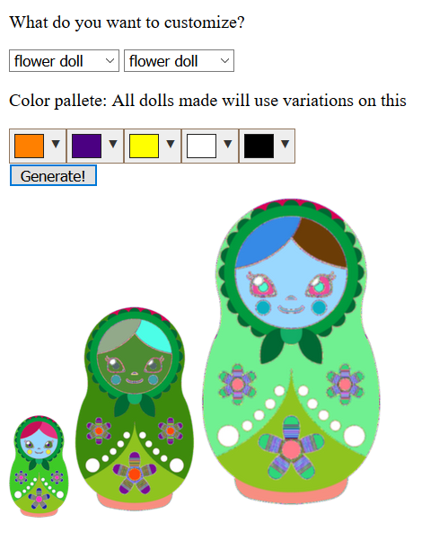

## Procjam 2019 README
### Mikel Matticoli and Diana Kumykova

### External Sources Used

- Filtrr - https://github.com/alexmic/filtrr/tree/master/filtrr2
		JS image processor
- Spectrum - https://bgrins.github.io/spectrum/
		jquery color picker
- JIMP - https://www.npmjs.com/package/jimp
		JS image processor using npm

## Link to itch.io submission: 
https://dkumykova.itch.io/procjam-2019

## Live demo:
https://russian-doll-generator.herokuapp.com/

## Screenshots:
Pick your color pallete

Click `Generate` to generate dolls!

Voila! Make cursed zombie russian dolls to your heart's content